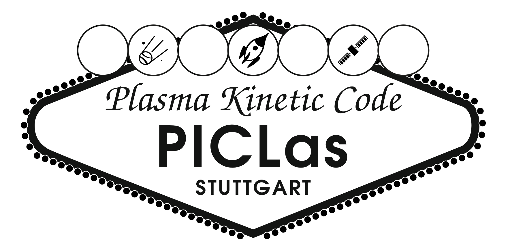

% ---
% title: |
%   {width=15cm}
%   PICLas v2.2.0
% subtitle: User Guide
% author:
%   - University of Stuttgart, Germany
%   - Institute for Aerodynamics and Gas Dynamics (IAG)
%   - Institute for Space Systems (IRS)
%   - boltzplatz - Numerical Plasma Dynamics
% institute: IAG IRS
% date: \today
% documentclass: scrreprt
% lang: en-US
% papersize: a4
% fontsize: 11pt
% geometry: "left=2.0cm,right=2.0cm,top=3.5cm,bottom=2.5cm"
% colorlinks: yes
% toc: yes
% header-includes:
%   - \input{header}
% bibliography: ../references.bib
% csl: ../ieee.csl
% link-citations: true
% ---

# Introduction

 [**PICLas**](https://github.com/piclas-framework/piclas)  is a three-dimensional simulation
 framework for Particle-in-Cell, Direct Simulation Monte Carlo and other particle methods that can be coupled for
 the simulation of collisional plasma flows.
 It features a high-order discontinuous 
 Galerkin (DG) simulation module for the solution of the time-dependent Maxwell 
 equations on unstructured hexahedral elements in three space dimensions. 
 The code was specifically designed for very high order accurate simulations on massively parallel 
 systems. 
 It is licensed under GPLv3, written in Fortran and parallelized with MPI. Implemented features are
 
 * Coupled Particle-in-Cell with Direct Simulation Monte Carlo methods
 * Particle-based Bhatnagar-Gross-Krook (Ellipsoidal Statistical, Shakov, Unified) and Fokker–Planck (Cubic, Ellipsoidal Statistical) models for continuum gas flows
 * Arbitrary order nodal polynomial tensor product basis using Gauss or Gauss Lobatto collocation 
   points for electrostatic and electromagnetic solvers
 * Matching high order curved mesh generation from external mesh formats (CGNS, GMSH) or 
   simple analytic blocks via the open source preprocessor [HOPR](http://hopr-project.org) {cite}`Hindenlang2015`
 * Non-conforming interfaces {cite}`Sonntag2017` based on the mortar approach {cite}`Kopriva2001,Bui2012` (electromagnetic solver)
 * Non-reflecting boundary conditions via CFS-PMLs {cite}`Copplestone2017` (electromagnetic solver)
 * Automatic domain decomposition for parallel simulations based on a space filling curve
 * High order low-storage explicit Runge-Kutta time integration {cite}`Carpenter1994`
 * I/O using the [HDF5](https://www.hdfgroup.org/solutions/hdf5/) library optimized for massively parallel jobs

## How this documentation is organized

This user guide is organized to both guide the first steps as well as provide a complete overview of 
the simulation code's features from a user and a developer point of view.

* Section {ref}`010_installation:Installation` contains step by step instructions from obtaining the source 
  code up to running a first simulation and visualizing the simulation results. In addition, it 
  provides an overview of the whole simulation framework and the currently implemented features.
* Section {ref}`020_workflow:Workflow` outlines the workflow starting with mesh generation and concluding with the visualization of results produced with **PICLas**.
* Section {ref}`features-and-models/index:Features & Models` shall serve as a reference for the models and features implemented in **PICLas**.
* Section {ref}`040_visu_output:Visualization & Output` presents the options and parameters for the output of particle data, field and flow variables.
* Section {ref}`050_tools:Tools Overview` lists tools within the **PICLas** repository, including the post-processing tools.
* Simulation tutorials are contained in Section {ref}`tutorials/index:Tutorials`.
* Cluster-specific user guidelines are given in Section {ref}`080_cluster_guide:Cluster Guidelines`.
<!-- * A complete list of all parameters is given in Section \ref{chap:parameterfile}. -->
<!-- * The unit test system used to test key routines with CTest is described in Section \ref{chap:unittest}. -->
