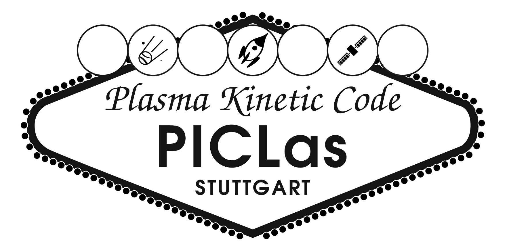

% ```{include} ../../README.md
% ---
% relative-docs: docs/
% relative-images:
% ---
% ```

# Welcome to PICLas Testing's documentation!



```{toctree}
---
maxdepth: 2
caption: Contents
---
000_userguide.md
010_installation.md
020_workflow.md
features-and-models/index.md
040_visu_output.md
050_tools.md
tutorials/index.md
070_unittest.md
080_cluster_guide.md
099_parameter.md
100_appendix.md
references.md
```


